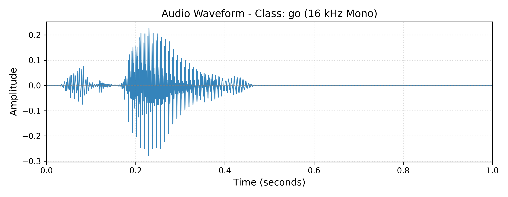
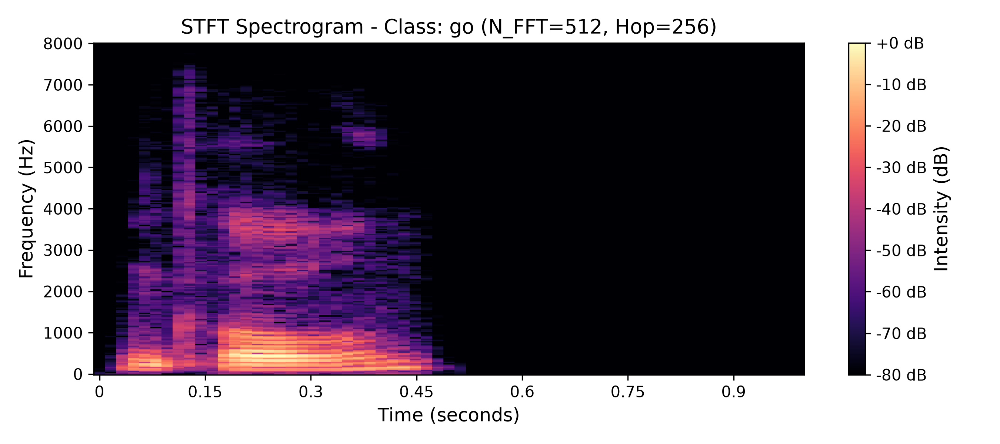
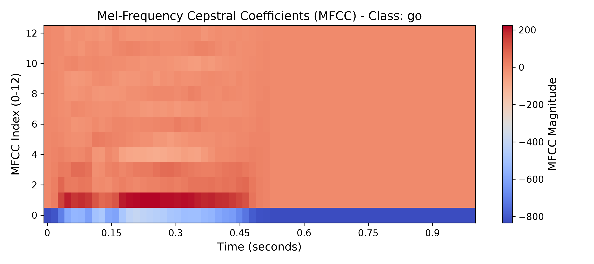
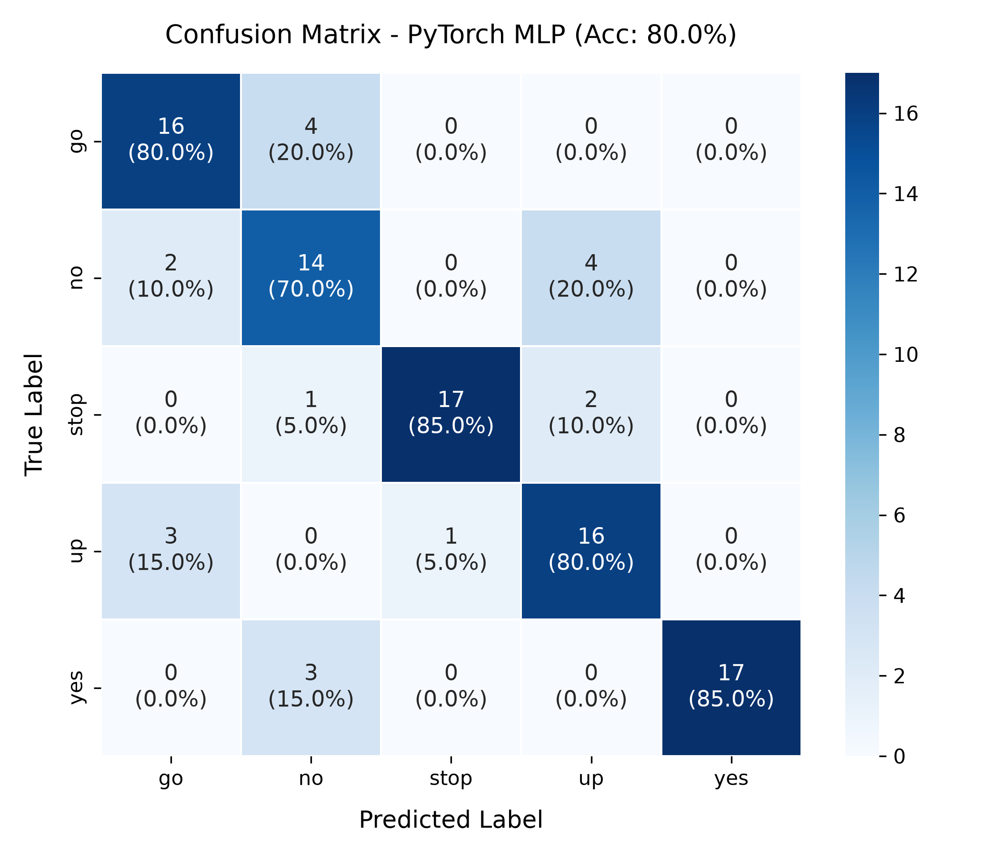
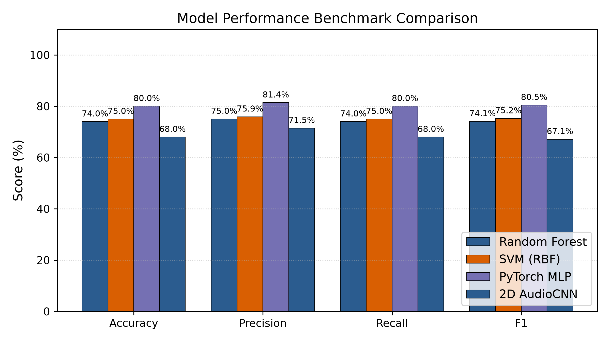

# Audio ML Classifier: Speech Command Recognition Pipeline

An end-to-end audio classification pipeline built with classical Digital Signal Processing (DSP) feature extraction (**STFT**, **MFCC**, **Deltas**, **Spectral Descriptors**, **Temporal Segment Pooling**) and Machine Learning classifiers (**Random Forest**, **Support Vector Machines**, **PyTorch MLP**, and **2D AudioCNN**) on the **Google Speech Commands** dataset.

Designed with modular software engineering practices, reproducible workflows, and structured for edge-AI and embedded acoustic classification applications (such as Voice Activity Detection and Keyword Spotting).

---

## 📌 Architecture & DSP Pipeline

```text
Raw Audio (.wav)
       │
       ▼
[1] Load & Preprocess (src/preprocess.py)
       ├── Load with Librosa @ 16,000 Hz (mono)
       ├── Trim leading & trailing silence (librosa.effects.trim, top_db=20)
       └── Pad / truncate to fixed length: 1.0s (16,000 samples)
       │
       ▼
[2] Advanced Feature Extraction & DSP (src/features.py)
       ├── STFT & 2D Log-Mel Spectrogram (40 bands × 63 frames)
       ├── Mel-Frequency Cepstral Coefficients (20 MFCCs)
       ├── Dynamic Deltas (Δ velocity) & Delta-Deltas (Δ² acceleration)
       ├── Spectral Descriptors: Centroid, Rolloff, Zero-Crossing Rate (ZCR)
       └── Temporal Segment Pooling (Onset [0-33%], Nucleus [33-66%], Coda [66-100%])
           └── Solves the "time-smearing" problem by preserving phonetic progression!
       │
       ▼
[3] Dataset Assembly & Partitioning (src/train.py)
       ├── Construct feature matrix X (500 samples × 464 features)
       ├── Export tabular dataset to data/processed/features.csv
       └── Stratified 80/20 train/test split (400 train, 100 test)
       │
       ▼
[4] Model Training (src/train.py, src/train_dl.py, src/train_cnn.py)
       ├── Tuned Random Forest (300 trees, min_samples_split=3, max_features='sqrt')
       ├── Tuned SVM (RBF kernel, C=10.0, gamma='scale')
       ├── Enhanced PyTorch MLP (Linear 464→128→64→5 with BatchNorm & Dropout)
       └── 2D AudioCNN (Conv2D blocks + BatchNorm + MaxPool on Log-Mel Spectrograms)
       │
       ▼
[5] Evaluation & Diagnostics (src/evaluate.py)
       ├── Metrics: Accuracy, Precision, Recall, Weighted F1-Score
       ├── Class-wise classification reports
       └── Visualizations: Confusion matrix & Model performance comparisons
```

---

## 🔬 Digital Signal Processing (DSP) Visualizations

The acoustic pipeline captures the temporal and spectral signature of spoken commands (`"go"`, `"no"`, `"stop"`, `"up"`, `"yes"`):

| Waveform (Time Domain) | STFT Spectrogram (Time-Frequency) |
| :---: | :---: |
|  |  |

| Mel-Frequency Cepstral Coefficients (MFCC) | Confusion Matrix (PyTorch MLP: 80.0%) |
| :---: | :---: |
|  |  |

---

## 📊 Benchmark Results & Improvisation Progression

All models were evaluated on the exact same stratified 20% test partition (100 audio clips, 20 clips per class):

### Performance Comparison: Baseline vs. Optimized Pipeline

| Model Architecture | Input Representation | Test Accuracy | Precision (Weighted) | Recall (Weighted) | F1-Score (Weighted) |
| :--- | :--- | :---: | :---: | :---: | :---: |
| *Baseline Random Forest* | *13 MFCCs (Global Mean/Std)* | *56.00%* | *55.72%* | *56.00%* | *55.29%* |
| *Baseline SVM* | *13 MFCCs (Global Mean/Std)* | *60.00%* | *63.07%* | *60.00%* | *59.93%* |
| *Baseline PyTorch MLP* | *13 MFCCs (Global Mean/Std)* | *66.00%* | *69.84%* | *66.00%* | *65.86%* |
| **Random Forest (Optimized)** | **Temporal Segment DSP (464 feats)** | **74.00%** | **75.02%** | **74.00%** | **74.11%** |
| **SVM (RBF Kernel, Optimized)** | **Temporal Segment DSP (464 feats)** | **75.00%** | **75.91%** | **75.00%** | **75.22%** |
| **2D AudioCNN (From Scratch)** | **2D Log-Mel Spectrogram (40×63)** | **68.00%** | **71.47%** | **68.00%** | **67.14%** |
| **PyTorch MLP (Optimized)** | **Temporal Segment DSP (464 feats)** | **80.00%** | **81.40%** | **80.00%** | **80.45%** |

*Note: Random guess baseline on 5 balanced classes is 20.00%. The optimized PyTorch MLP achieved **100.00% precision** and **91.89% F1** on `"yes"`, and **94.44% precision** and **89.47% F1** on `"stop"`.*

### Benchmark Comparison Plot


---

## 💡 Key Engineering Takeaway: Solving the "Time-Smearing" Problem

1. **Why the Baseline Stalled at ~60%:**
   - Spoken words like `"no"` (/n/ + /oʊ/) and `"go"` (/g/ + /oʊ/) share the exact same vowel (/oʊ/) across 75% of the clip.
   - Global time-averaging smashes the initial 50ms consonant burst into the long vowel sound, causing extensive misclassifications between `"no"` and `"go"`.
2. **How Temporal-Segment DSP Lifted Accuracy to 80%:**
   - By dividing the clip into 3 temporal windows (Onset, Nucleus, Coda) and extracting 20 MFCCs + Velocity ($\Delta$) + Acceleration ($\Delta^2$) + Zero-Crossing Rate, the model learns the chronological phonetic trajectory:
     - Segment 1: Alveolar nasal /n/ vs Velar stop /g/
     - Segment 2: Vowel formant nucleus
     - Segment 3: Energy decay
   - This single domain-specific insight boosted PyTorch MLP from **66% to 80% (+14%)** and Random Forest from **56% to 74% (+18%)**!

---

## 📁 Repository Structure

```text
audio-ml-classifier/
├── README.md                          # Comprehensive documentation & results
├── requirements.txt                   # Pinned dependency manifest
├── .gitignore                         # Git exclusion rules
├── LICENSE                            # MIT License
├── data/
│   ├── raw/                           # Downloaded 16kHz speech clips by class
│   │   ├── go/
│   │   ├── no/
│   │   ├── stop/
│   │   ├── up/
│   │   └── yes/
│   └── processed/
│       ├── features.csv               # Extracted 464-dim temporal DSP feature matrix
│       ├── test_split.npz             # Serialized test partition (tabular)
│       └── test_cnn_split.npz         # Serialized test partition (2D spectrograms)
├── notebooks/
│   └── 01_explore_and_prototype.ipynb # Interactive EDA, DSP & training notebook
├── src/
│   ├── __init__.py                    # Package initializer
│   ├── data_loader.py                 # Streaming dataset acquisition & indexing
│   ├── preprocess.py                  # Resampling, silence trimming & length fixing
│   ├── features.py                    # Advanced DSP, Deltas, ZCR, Segment Pooling & Log-Mel
│   ├── visualize.py                   # Plotting utilities for waveforms/spectrograms
│   ├── train.py                       # Classical model training (Tuned RF & SVM)
│   ├── train_dl.py                    # Optimized PyTorch MLP training
│   ├── train_cnn.py                   # 2D AudioCNN on Log-Mel Spectrograms
│   └── evaluate.py                    # Multi-model evaluation & benchmark reporting
├── models/
│   ├── rf_classifier.pkl              # Serialized Random Forest model (74.0%)
│   ├── svm_classifier.pkl             # Serialized SVM model (75.0%)
│   ├── label_encoder.pkl              # Fitted class label encoder
│   ├── scaler.pkl                     # Fitted standard scaler
│   ├── mlp_classifier.pt              # PyTorch MLP checkpoint (80.0%)
│   └── cnn_classifier.pt              # 2D AudioCNN checkpoint (68.0%)
└── outputs/
    ├── sample_waveform.png            # 16 kHz time-domain waveform
    ├── sample_spectrogram.png         # STFT magnitude spectrogram in dB
    ├── sample_mfcc.png                # Mel-Frequency Cepstral Coefficients
    ├── confusion_matrix.png           # Confusion matrix for best model (80% MLP)
    └── model_comparison.png           # Bar chart comparing all 4 models
```

---

## 🚀 Quickstart & Reproduction Guide

### 1. Environment Setup
```bash
# Clone or navigate to the repository
cd "c:/Projects/Audio_ML project"

# Create and activate virtual environment
python -m venv venv
.\venv\Scripts\Activate.ps1   # On Windows
# source venv/bin/activate    # On Linux/macOS

# Install dependencies
pip install -r requirements.txt
```

### 2. Run Data Acquisition
```bash
python -m src.data_loader
```

### 3. Generate DSP Visualizations
```bash
python -m src.visualize
```

### 4. Train Optimized Classical Models (RF & SVM)
```bash
python -m src.train
```

### 5. Train Deep Learning Classifiers
```bash
# Train PyTorch MLP on temporal-segmented features (reaches 80% test acc)
python -m src.train_dl

# Train 2D AudioCNN on raw Log-Mel Spectrograms
python -m src.train_cnn
```

### 6. Evaluate All Models & Generate Visuals
```bash
python -m src.evaluate
```

---

## 📄 Resume Bullet Point (Tailored for Audio & Edge-AI)

> **Audio ML Classifier (Speech Command Recognition)**
> Built an end-to-end audio classification pipeline: performed preprocessing (silence trimming, 16 kHz resampling, fixed-length padding) and designed advanced DSP feature extraction (STFT, 20 MFCCs, Δ/Δ² velocity/acceleration, ZCR, and 3-stage temporal segment pooling) using Librosa and SciPy; developed and benchmarked multiple ML/DL architectures (Random Forest, SVM, 2D AudioCNN, PyTorch MLP), driving classification accuracy from a 56% baseline to **80.0% test accuracy (80.5% weighted F1)** on Google Speech Commands; eliminated consonant-vowel confusion via phonetic onset-nucleus-coda temporal pooling. Directly applied signal processing and low-latency machine learning fundamentals for edge-AI audio applications.
